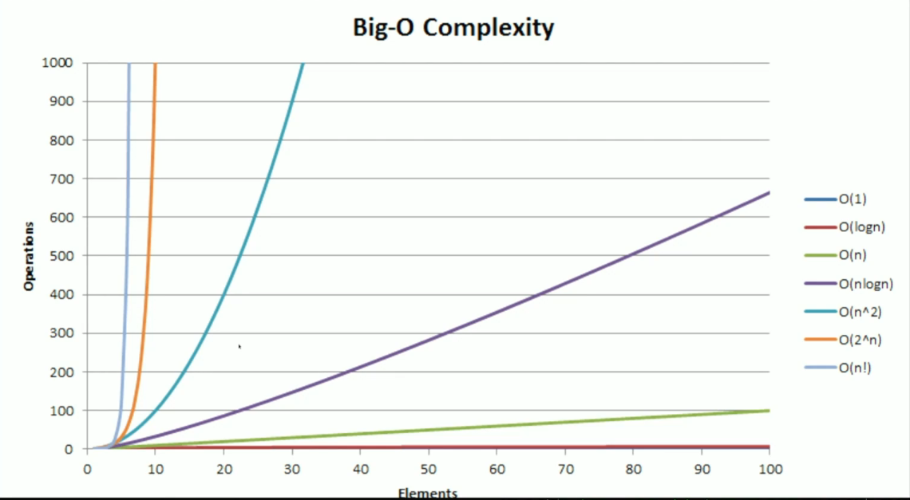

# Basics

## Big O Time complexity

- Growth is with respect to the input
- Always go for the worst case scenarios
- Drop constants

**O(n²) and O(n³)**: count the loops
**O(nlog n)**: quick sort
**O(log n)**: binary search
**O(sqrt(n))**: very unique, not very mentioned

## Arrays Data Structure

Arrays are continuous memory spaces where the elements are from the same type

Q: if `const a = []` isn't an array, what is it?

In node, when you can use `new ArrayBuffer(byteLength)` to create structures that resembles true arrays. Aftehr that you can creates "views" into this the array buffer memory space using `new Uint8Array(arr)`, `new Uint16Array(arr)` and others

Accessing an index of an array is a O(1) operation.

Array do not have operation live 'append', 'push', 'pop', etc. They have fixed size and we override the content in the memory space. However, the data structure we normally use have arrays under the hood, implementing those methods and the "dynamic size" of the memory space
