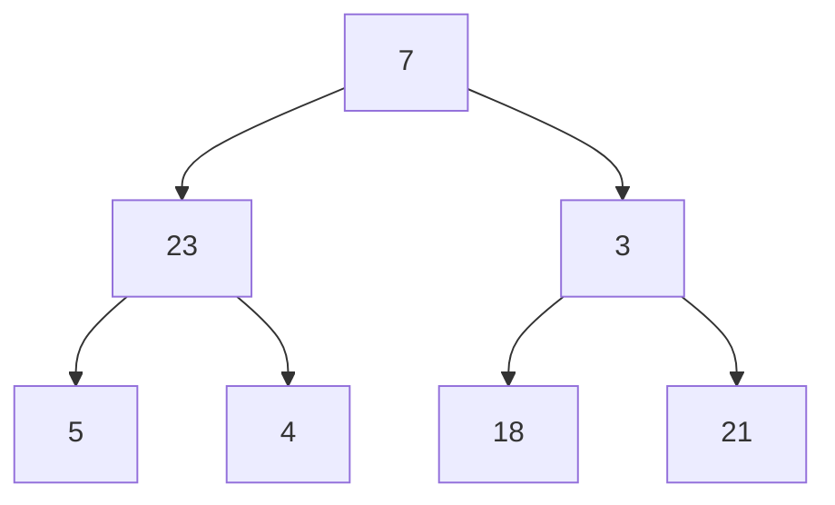

# Trees

`All programming eventually leads to trees' ... but in a sense it is a LinkedList with multiple paths

Where are trees:
- file system
- the dom is a tree
- trees are massively important in compilers. You have probably mininumly heard the term Abstract Syntax Tree
- many other places

```ts
type Node<T> {
    value: T
    children: Node<T[]>
}

type BNode<T> {
    value: T
    left: BNode<T>
    right: BNode<T>
}
```

## Terminology

- root: top most node
- height: longest path from the root to the most child node
- binary tree: a tree in which has at most 2 children, at least 0 children
- general tree: a tree with 0 or more children
- binary search tree: a tree in which has a specific ordering to the nodes and at most 2 children
- leaves: a node without a children
- balanced: a tree is perfectly balanced when any node's left and right children have the same height
- branching factor: the amount of children a tree has


## Traversals

An attempt to visit every single node, **we will focus on binary trees** and use recursion.

Strategies:
- pre order: first visit the node, then recurseLeft, return at the leaf then recurseRight
- in order: recurseLeft, visit the node, recurseRight -> In BinarySearch tree this will print out a ordered array
- post order: recurseLeft, recurseRight then visit the node



```js
const preOrder = [7, 23, 5, 4, 3, 18, 21]
const inOrder = [5, 23, 4, 7, 18, 3, 21]
const postOrder = [5, 4, 23, 18, 21, 3, 7]
```

Depth First traversals or Depth First Search
[BTPreOrder](./kata-machine/src/day1/BTPreOrder.ts)
[BTInOrder](./kata-machine/src/day1/BTInOrder.ts)
[BTPostOrder](./kata-machine/src/day1/BTPostOrder.ts)

Note: We use a BinaryTree, but under the hood we have virtually used a stack for function calling (recursion!!!)
