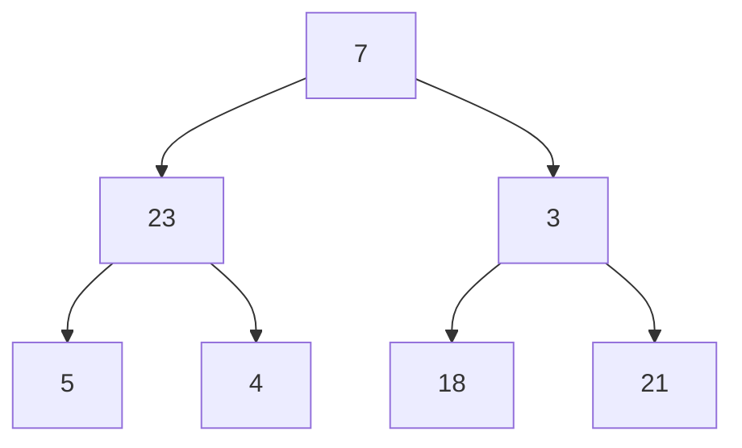

# Tree Search

## Breadth-First Search

Kind of a Deep-First Search ... we will use Queue!
We will visit all nodes in the same level of tree on each step (tree level traversal)

[BTBFS](./kata-machine/src/day1/BTBFS.ts)
Using a true Queue, time complexity will be O(n)
If we use JS's ArrayList, it will be O(n²) since un/shift it will make it re-order the elements

## Practice

TLDR: Don't use Breadth First!! use Depth-First as it PRESERVES SHAPE
[Binary Tree Comparison](./kata-machine/src/day1/CompareBinaryTrees.ts)

## Binary Search Tree

Is a Binary Tree but it has a rule to be applied on each node, left side is smaller-equal then node and right side is greater-equal then node (looks like quick sort)

find operation has variable complexity time -> O(logn ~ n)

[Depth First Search Binary Search Tree](./kata-machine/src/day1/DFSOnBST.ts)

**insertion** will be similar to find in a sense it will recurse, but **in the case of null** it actually **insert a new node, mutating the tree**. It lead to imbalances in the tree, requiring rotation algorithm to rebalanced

**deletion is the trickiest**:
- deleting a leaf is simple as it has no childs, very straight forward
- deleting a node that has ONE child, you can the grand parent point to the child, similar to LinkedList
- deleting a node that has TWO children:
  - we need to find the largest element (go-right!) on the left subtree and then replace the node with it (be careful if the node has a child to the left)
  - we need to find the smallest element (go-left!) on the right subtree
  - choose the side with the higher "hight" for node deletion

