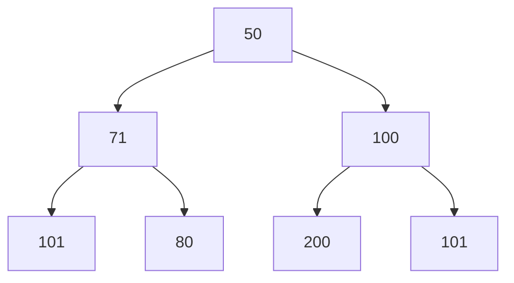

# Heaps

**PRIORITY QUEUE**

TLDR: It is a binary tree where every child and grand child is smaller (MaxHeap), or smaller (MinHeap) than the current is node

- Insertions and deletion require the tree to be readjusted
- **There is no traversing the tree**



Unlike Binary Tree, Heaps have week ordering

```js
// can be stored using an array like structure
const heap = [50, 71, 100, 101, 80, 200, 101]

// parent-child node formula
// child1_index = 2*(parent_index) +1
// child2_index = 2*(parent_index) +2

// child-parent node formula
// parent_index = (child_index - 1) // 2 (int division)

// to have a complete data structure, we have need to keep track of the length
```

[Min Heap](./kata-machine/src/day1/MinHeap.ts)

Time Complexity is O(logn)


## Trie

If it is not a priority queue, its a trie.
Tri Tree are named after Retrieval Tree

TLDR: Think of auto-complete, it can be done in O(1) give certain conditions
Very asked in interview for auto-complete or caching mechanisms

Deapth-First Search would give us the words in alphabetical order

```ts
type Node {
    value: string
    children: Node[]
    score: number
    freq: number
    isWord: boolean
}
```

[Trie](./kata-machine/src/day1/Trie.ts)

